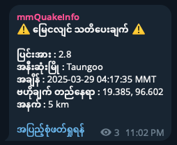

# 🌐 Myanmar Earthquake Alert Bot

[](https://www.python.org/)
[](LICENSE)

## 📖 Overview
Real-time earthquake monitoring system that sends alerts to Telegram for seismic activities in Myanmar. Built with:  
- **RSS Feed Parsing** from Thai Meteorological Department
- **Geospatial Filtering** using reverse geocoding
- **Timezone Conversion** (UTC → MMT)
- **Telegram Integration** with message rate limiting



## 🛠 Features
| Feature | Description | Technical Implementation |
|---------|-------------|--------------------------|
| 🕒 Real-time Monitoring | Checks TMD feed every 10 seconds | Asynchronous HTTP requests with `aiohttp` |
| 🌏 Location Filtering | Myanmar-specific filtering | Reverse geocoding with `reverse_geocoder` |
| ⏰ Time Conversion | UTC → MMT (UTC+6:30) | Datetime manipulation with timezone offsets |
| 🔄 Duplicate Prevention | File-based ID tracking | Atomic writes to `processed_ids.txt` |
| 🇺🇸 Translation | Thai → English | Google Translate API integration |
| 📱 Telegram Alerts | Formatted notifications | MarkdownV2 message formatting |

## 📲 Installation
1. **Clone Repository**
   ```bash
   git clone https://github.com/mgkaung/mmEarthquakeInfo.git
   cd mmEarthquakeInfo
2. **Install reqired packages**
   ```bash   
   pip install -r requirements.txt
3. **Configure**
   ```bash
   Insert your bot token and channel in the config.py  
4. **Run script**
   ```bash
   python quake.py  
